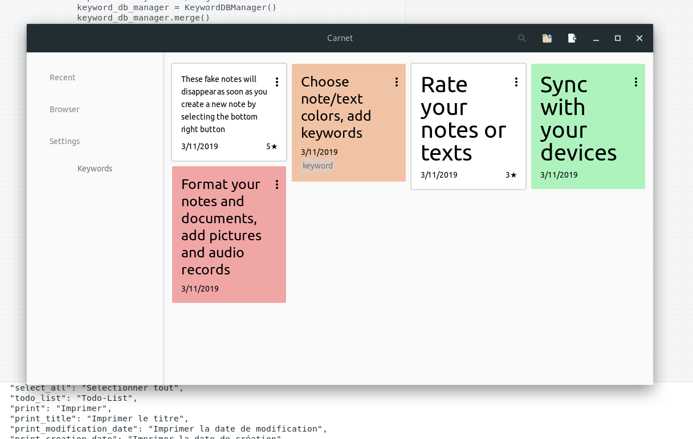
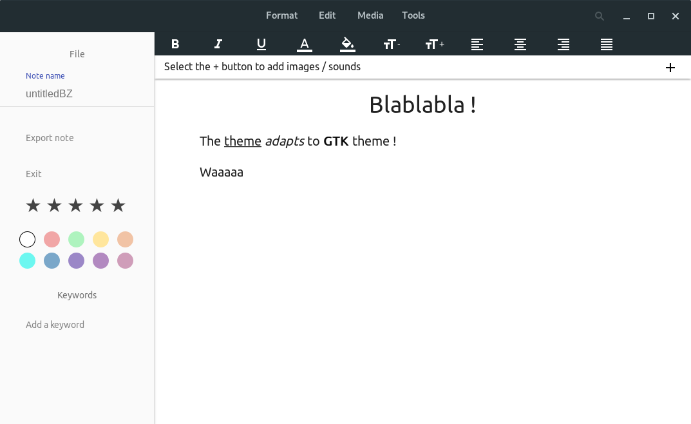

# CarnetGTK
Python + GTK version of carnet

[Full app description + other versions](https://github.com/PhieF/CarnetDocumentation)

Please don't send bug report, this is still an early version.

Requires https://github.com/PhieF/CarnetElectron 

Build instructions will soon be available.

## Goals

1. Implementing all backend API to get rid of the electron version on linux and having a fully working version of Carnet inside GTK webkit

2. Integrating some ui element in gnome environment. Make use of CSD Gnome headerbar (done) + adapt webview css to color of the theme (on its way)

3. First Carnet window should be only GTK, no HTML

## Screenshots of current version

